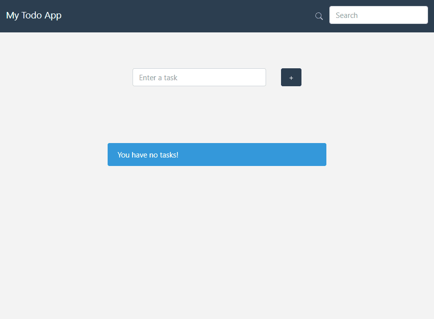

## Kubernetes Deployment with Docker and Minikube
#### Simple ToDo Web App with React and Flask



### Overview
This repository contains resources and instructions for deploying an application using Kubernetes with Docker and Minikube. The application consists of frontend and backend components, orchestrated with Kubernetes manifests. 

### Prerequisites
- [Docker](https://docs.docker.com/get-docker/) installed on your local machine
- [Minikube](https://minikube.sigs.k8s.io/docs/start/) installed on your local machine
- Basic understanding of Kubernetes concepts

### Directory Structure

.
├── backend
│ ├── instance
│ ├── migrations
│ └── todo
├── frontend
├── kubernetes
└── proxy

#### Four Docker containers are used to run this application.

- Nginx (as a reverse proxy)
- React with Nginx
- Flask
- PostgreSQL


### Usage

1. **Start Minikube**: Start Minikube with the desired configurations. For example:

  ```
  minikube start --kubernetes-version=v1.23.0 --memory=6g --bootstrapper=kubeadm --extra-config=kubelet.authentication-token-webhook=true --extra-config=kubelet.authorization-mode=Webhook --extra-config=scheduler.bind-address=0.0.0.0 --extra-config=controller-manager.bind-address=0.0.0.0
  ```


2. **Load Docker Images**: Load Docker images into Minikube.

  ```
  minikube image load todo-react-flask-pgsql-todo-ui
  minikube image load todo-react-flask-pgsql-todo-app
  minikube image load todo-react-flask-pgsql-todo-proxy
  ```

3. **Deploy Resources**: Apply Kubernetes manifests.

kubectl apply -f kubernetes/


4. **Access Services**:
- To access the frontend service:
  ```
  minikube service todo-ui
  ```
- To access the proxy service: **(Use this for full functional app)**
  ```
  minikube service todo-proxy
  ```

5. **Additional Commands**:
- Get deployments, services, and jobs:
  ```
  kubectl get deployments,services,jobs -o wide
  ```
- View Horizontal Pod Autoscaler (HPA):
  ```
  kubectl get hpa
  ```
- Enable Metrics Server (required for HPA):
  ```
  minikube addons enable metrics-server
  ```
- Access Kubernetes Dashboard:
  ```
  minikube dashboard
  ```

6. **Database Operations**:
- Access PostgreSQL database:
  ```
  kubectl exec -it pod/todo-db-<POD-ID> -- bash
  psql -h 127.0.0.1 -U tododbuser -d tododb
  
  ```

- View tables and data:

  ```
  \dt
  select * from tasks;
  ```

7. **Testing Horizontal Pod Autoscaling**:
- Run load generator to simulate traffic:
  ```
  kubectl run -i --tty load-generator --rm --image=busybox:1.28 --restart=Never -- /bin/sh -c "while sleep 0.001; do wget -q -O- http://todo-app:8000/api/tasks; done"
  ```
- View Horizontal Pod Autoscaler:
  ```
  kubectl get hpa
  ```
- View pod resource usage:
  ```
  kubectl top pod
  ```

### Cleanup
To clean up the resources, use the following commands:

```
kubectl delete -f kubernetes/
minikube stop
```


### Acknowledgements
Special thanks to the original autor of the apllication.
  - [Github Repo.](https://github.com/mmurayama/todo-react-flask-pgsql?tab=readme-ov-file)
 